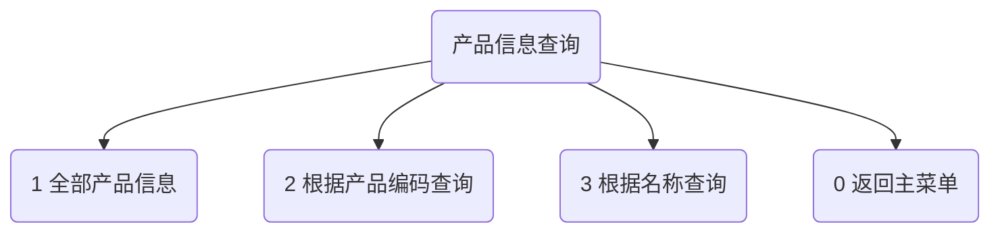

# SSMS
Data Analysis Course Project

# <center>Develop a stand-alone sales management system

<center>Name：Xiaoyi Zhang


</center>

### problem description

* Background description.
  A company has N salesmen ( N < 100, the number of personnel is changing ) and sells M products ( M < 1000, the number of changes ). The company needs to track and record the sales performance of each salesman and the sales of each product. And through the sales analysis menu to complete the following tasks : search for sales records of a salesman, search for sales records of a product, according to sales sales of salesman 's performance ranking, according to sales of product performance ranking, and so on. Based on these requirements, a stand-alone sales management system is needed, which is run and managed by an administrator to manage and maintain information such as sales staff, products and sales records.

* Data description.
  The main information that the system needs to deal with are : salesman ( number ( only ), name ( not only ), department, level, status ), product ( product code ( only ), product name, sales guide price, inventory ), sales record ( order number ( only ), sales date, sales staff number, product code, sales price, sales volume ). The system at least needs to track this information, and additional data can be added for program processing.

* Function description.
  The system at least needs to have the following functions : 
( 1 ) Batch from the file ( csv or xlsx format ) import salesperson, product, sales record data ; 
( 2 ) manually add product information, modify the existing product information, update product inventory, delete product entries ( or inventory clearance ) ; 
( 3 ) manually add salesperson information, modify salesperson information, delete salesperson information ( or leave ) ; 
( 4 ) manually add sales records, modify sales records, delete sales records ; 
( 5 ) According to the work number or name query display salesman information ; pagination list shows all salesman information ; 
( 6 ) According to the product code or product name ( fuzzy ) query display product information ; pagination list shows all product information ; 
( 7 ) according to the date, salesperson or product portfolio query sales records and summary data ; 
( 8 ) According to the sales of sales staff performance ranking ( from high to low ), according to the sales of products ranking ( from high to low ) ; 
( 9 ) automatically save all the data to the backup file ( format optional ) when you choose to exit the system from the menu ; 
( 10 ) System recovery function, import all data from the backup file.

* Business logic constraints. 
In business processing, the following logic needs to be satisfied : 
( 1 ) The sales price defaults to the guiding price and cannot be lower than the guiding price ; 
( 2 ) When adding sales records, the corresponding salesmen and products must exist, the inventory is not zero, and the salesman status is on-the-job ; 
( 3 ) When deleting a product, if the sales record of the product is not empty, it can only clear its inventory, but not delete the basic information of the product ; 
( 4 ) When deleting a salesperson, if the sales record of the salesperson is not empty, his status can only be set to ' leave ', and the basic information of the salesperson cannot be deleted ; 
( 5 ) When a sales record is added, the sales volume cannot exceed the current inventory. After adding the sales record, the inventory needs to be reduced accordingly ; 
( 6 ) Product prices, sales and other data can not be negative. 
If the above logic is not satisfied, the system needs to prompt for errors and write error information to the log ( error.log ), format and content customized, but can not interrupt the execution of the program. Unsatisfied logical modification and deletion requests will be rejected. 
 
 
### demand analysis 
 
( 1 ) to complete the maintenance of product basic information : that is, the entity 's basic information to add, delete, change. 
 
( 2 ) to complete the product basic information query. 
 
( 3 ) can complete the maintenance of the basic information of the salesman : that is, the addition, deletion and modification of the basic information of each entity. 
 
( 4 ) Can complete the salesman basic information query. 
 
( 5 ) Able to complete the maintenance of basic information on sales records : that is, the entity 's basic letter

~~~ mermaid
graph TB;
a(menu)-->a1("1 产品信息查询")
a(menu)-->a2("2 产品信息维护")
a(menu)-->a3("3 业务员信息查询")
a(menu)-->a4("4 业务员信息维护")
a(menu)-->a5("5 销售记录信息查询")
a(menu)-->a6("6 销售记录信息维护")
a(menu)-->a7("7 销售排名")
a(menu)-->a8("0 保存并退出程序")
~~~


### 概要设计

~~~ python
def menu1():
    print("\n----menu1----")
    print("1 全部产品信息")
    print("2 根据产品编码查询")
    print("3 根据名称查询")
    print("0 返回主菜单")
    print("------------")
def menu2():
    print("\n----menu2----")
    print("1 产品入仓库")
    print("2 产品售出")
    print("3 批量导入产品信息")
    print("4 手动添加产品信息")
    print("5 删除产品信息")
    print("6 修改产品信息")
    print("0 返回主菜单")
    print("------------")
def menu3():
    print("\n----menu3----")
    print("1 全部业务员信息")
    print("2 根据工号查询")
    print("3 根据姓名查询")
    print("0 返回主菜单")
    print("------------")
def menu4():
    print("\n----menu4----")
    print("1 批量导入业务员信息")
    print("2 手工添加业务员信息")
    print("3 删除业务员信息")
    print("4 修改业务员信息")
    print("0 返回主菜单")
    print("------------")
def menu5():
    print("\n----menu5----")
    print("1 全部销售记录信息")
    print("2 组合查询")
    print("0 返回主菜单")
    print("------------")
def menu6():
    print("\n----menu6----")
    print("1 批量导入销售记录")
    print("2 手工添加销售记录")
    print("3 删除销售记录")
    print("4 修改销售记录")
    print("0 返回主菜单")
    print("------------")
def menu7():
    print("\n----menu7----")
    print("1 根据销售额对销售员的业绩进行排名")
    print("2 根据销售额对产品进行排名")
    print("0 返回主菜单")
    print("------------")
~~~




~~~ mermaid
graph TB;
B(产品信息维护)-->B1("1 产品入仓库")
B(产品信息维护)-->B2("2 产品售出")
B(产品信息维护)-->B3("3 批量导入产品信息")
B(产品信息维护)-->B4("4 手动添加产品信息")
B(产品信息维护)-->B5("5 删除产品信息")
B(产品信息维护)-->B6("6 修改产品信息")
B(产品信息维护)-->B7("0 返回主菜单")
~~~

~~~ mermaid
graph TB;
C("业务员信息查询")-->c1("1 全部业务员信息")
C("业务员信息查询")-->c2("2 根据工号查询")
C("业务员信息查询")-->c3("3 根据姓名查询")
C("业务员信息查询")-->c4("0 返回主菜单")
~~~

~~~ mermaid
graph TB;
D("业务员信息维护")-->d1("1 批量导入业务员信息")
D("业务员信息维护")-->d2("2 手工添加业务员信息")
D("业务员信息维护")-->d3("3 删除业务员信息")
D("业务员信息维护")-->d4("4 修改业务员信息")
D("业务员信息维护")-->d5("0 返回主菜单")
~~~

~~~ mermaid
graph TB;
E("销售记录信息查询")-->e2("1 全部销售记录信息")
E("销售记录信息查询")-->e3("2 组合查询")
E("销售记录信息查询")-->e5("0 返回主菜单")
~~~

~~~ mermaid
graph TB;
F("销售记录信息维护")-->f1("1 批量导入销售记录")
F("销售记录信息维护")-->f2("2 手工添加销售记录")
F("销售记录信息维护")-->f3("3 删除销售记录")
F("销售记录信息维护")-->f4("4 修改销售记录")
F("销售记录信息维护")-->f5("0 返回主菜单")
~~~

~~~ mermaid
graph TB;
~~~

~~~ mermaid
graph TB;
G("销售排名")-->g1("1 根据销售额对销售员的业绩进行排名")
G("销售排名")-->g2("2 根据销售额对产品进行排名")
G("销售排名")-->g3("0 返回主菜单")
~~~


###  detail design

**data is the file : products.csv ; records.csv ; salemen.csv, based on the data provided x, using the file index index to search.**

~~~ python
def seek(data, x, index):
    for i in data:
        if x == i[index]:
            return i
    return []
~~~

**Fuzzy query by name**

~~~ python
def vague_seek(data, x, index):
    result = data[0].reshape(1, len(data[0]))
    for i in data:
        for j in x:
            if j not in i[index]:
                break
        else:
            result = np.append(result, i.reshape(1, len(i)), axis=0)
    return np.delete(result, 0, axis=0)
~~~

**Combination query function**

~~~ python
def com_seek(record_data, time, sale, prod):
    result = record_data[0].reshape(1, len(record_data[0]))
    for i in record_data:
        if i[1] == time and i[2] == sale and i[3] == prod:
            result = np.append(result, i.reshape(1, len(i)), axis=0)
    return np.delete(result, 0, axis=0)
~~~

**index**

~~~ python
def index(data, x):
    for i in range(len(data)):
        if (data[i] == x).all():
            return i
    return -1
~~~

**Display information about products, salespeople, sales records**

~~~ python
def show_product(x):
    if len(x.shape) == 1:
        print("产品编码：%s\t产品名称：%s\t销售指导价：%s\t库存量：%s\t\n" % (x[0], x[1], x[2], x[3]), end='')
    else:
        for xx in x:
            print("产品编码：%s\t产品名称：%s\t销售指导价：%s\t库存量：%s\t\n" % (xx[0], xx[1], xx[2], xx[3]), end='')
def show_saleman(x):
    if len(x.shape) == 1:
        print("工号：%s\t姓名：%s\t部门:%s\t级别：%s\t状态：%s\t\n" % (x[0], x[1], x[2], x[3], x[4]), end='')
    else:
        for xx in x:
            print("工号：%s\t姓名：%s\t部门:%s\t级别：%s\t状态：%s\t\n" % (xx[0], xx[1], xx[2], xx[3], xx[4]), end='')
def show_record(x):
    if len(x.shape) == 1:
        print("订单号：%s\t销售日期：%s\t销售员工号:%s\t产品编码：%s\t销售价格：%s\t销售数量：%s\t\n" % (x[0], x[1], x[2], x[3], x[4], x[5]), end='')
    else:
        for xx in x:
            print("订单号：%s\t销售日期：%s\t销售员工号:%s\t产品编码：%s\t销售价格：%s\t销售数量：%s\t\n" % (xx[0], xx[1], xx[2], xx[3], xx[4], xx[5]), end='')
~~~

Structural design of main classes 
 
Product attributes : product code, product name, sales price, inventory 
 
Salesperson ' s attributes : work number, name, department, level, status 
 
Sales record attributes : order number, sales date, sales staff number, product code, sales price, sales volume 
 
** Manage menu functionality ** 
 
One. Product Information Inquiry 
 
1. Output all product information

```python
if x == 1:
    for i in products:
        show_product(i)
```

2.Query by product code

```python
elif x == 2:
    x = int(input("请输入要查询的产品编码："))
    i = seek(products, x, 0)
    if len(i) == 0:
        print("请输入正确的产品编码！")
    else:
        show_product(i)
```

3.Query by name

```python
                elif x == 3:
                    x = input("请输入要查询的产品名称：")
                    i = vague_seek(products, x, 1)
                    if len(i) != 0:
                        show_product(i)
                    else:
                        print("没有这个产品！")
```

TWO.Product Information Maintenance

1.Products into the warehouse

```python
if x == 1:
    x = int(input("请输入要入库的产品的编码："))
    y = int(input("请输入入库数量："))
    if y <= 0:
        print("入库数量必须大于0")
        break
    i = seek(products, x, 0)
    if len(i) == 0:
        print("产品编码错误，入库失败！")
    else:
        i[3] += y
        print("入库成功！")
```

2.Sold products

```python
elif x == 2:
    x = int(input("请输入要售出的产品的编码："))
    y = int(input("请输入售出数量："))
    if y <= 0:
        print("出库数量必须大于0")
        break
    i = seek(products, x, 0)
    if len(i) == 0:
        print("产品编码错误，出库失败！")
    elif i[3] < y:
        print("产品数量不够，出库失败！")
    else:
        i[3] -= y
        print("出库成功！")
```

3.Batch import product information

```python
elif x == 3:
    x = input("请输入要导入的产品信息的文件地址（需为.csv文件，且第一行为产品属性名称，编码为utf-8）:")
    f = np.array(pd.read_csv(x, encoding="utf8"))
    for ff in f:
        if len(seek(products, ff[0], 0)) == 0:
            products = np.append(products, ff.reshape(1, len(ff)), axis=0)
        else:
            print("该产品编码已被占用，不导入！")
            continue
```

4.Manually add product information

```python
elif x == 4:
    x = int(input("请输入要添加的产品的编码："))
    if len(seek(products, x, 0)) != 0:
        print("已存在该产品信息！")
    else:
        product = np.array(x, dtype=object)
        product = np.append(product, input("请输入要添加的产品的名称："))
        product = np.append(product, int(input("请输入要添加的产品的销售指导价：")))
        product = np.append(product, int(input("请输入要添加的产品的数量：")))
        products = np.append(products, product.reshape(1, len(product)), axis=0)
        print("添加成功！")
```

5.Delete product information

```python
elif x == 5:
    x = int(input("请输入要删除的产品的编码："))
    i = seek(products, x, 0)
    if len(i) == 0:
        print("产品编码错误，删除失败！")
    elif len(seek(records, x, 0)) != 0:
        i[3] = 0
        print("产品销售记录不为空，清空库存！")
    else:
        products = np.delete(products, index(products, i), axis=0)
        print("删除成功！")
```

6.Modify product information

~~~ python
                elif x == 6:
                    x = int(input("请输入要修改的产品的编码："))
                    i = seek(products, x, 0)
                    if len(i) == 0:
                        print("产品编码错误，修改失败！")
                    else:
                        i[1] = input("请输入修改后的产品的名称：")
                        i[2] = int(input("请输入修改后的产品的销售指导价："))
                        i[3] = int(input("请输入修改后的产品的库存数量："))
~~~

THREE、Salesman Information Inquiry

1.All salesperson information

~~~ python
                if x == 1:
                    for i in salemen:
                        show_saleman(i)
~~~

2.Query by work number

~~~ python
                elif x == 2:
                    x = int(input("请输入要查询的业务员的工号："))
                    i = seek(salemen, x, 0)
                    if len(i) == 0:
                        print("请输入正确的工号！")
                    else:
                        show_saleman(i)
~~~

3.Query by name

~~~ python
                elif x == 3:
                    x = input("请输入要查询的业务员的姓名：")
                    i = vague_seek(salemen, x, 1)
                    if len(i) != 0:
                        show_saleman(i)
                    else:
                        print("没有这个姓名的业务员！")
~~~

FOUR.Businessman information maintenance 
 
1. Batch import of salesperson information

~~~ python
                if x == 1:
                    x = input("请输入要导入的业务员信息的文件地址（需为.csv文件，且第一行为业务员属性名称，编码为utf-8）:")
                    f = np.array(pd.read_csv(x, encoding="utf8"))
                    for ff in f:
                        if len(seek(salemen, ff[0], 0)) == 0:
                            salemen = np.append(salemen, ff.reshape(1, len(ff)), axis=0)
                        else:
                            print("该销售员工号已被占用，不导入！")
                            continue
~~~

2.Add salesperson information manually

~~~ python
                elif x == 2:
                    x = int(input("请输入要添加的业务员的工号："))
                    if len(seek(salemen, x, 0)) != 0:
                        print("已存在该业务员信息！")
                    else:
                        man = np.array(x, dtype=object)
                        man = np.append(man, input("请输入要添加的业务员的姓名："))
                        man = np.append(man, int(input("请输入要添加的业务员所在部门：")))
                        man = np.append(man, int(input("请输入要添加的业务员级别：")))
                        man = np.append(man, input("请输入要添加的业务员状态："))
                        salemen = np.append(salemen, man.reshape(1, len(man)), axis=0)
                        print("添加成功！")
~~~

3.Delete salesperson information

~~~ python
                elif x == 3:
                    x = int(input("请输入要删除的业务员的工号："))
                    i = seek(salemen, x, 0)
                    if len(i) == 0:
                        print("业务员工号错误，删除失败！")
                    elif len(seek(records, x, 2)) != 0:
                        i[4] = "离职"
                        print("业务员有销售记录，将其设置为离职！")
                    else:
                        salemen = np.delete(salemen, index(salemen, i), axis=0)
                        print("删除成功！")
~~~

4.Modify salesperson information

~~~ python
                elif x == 4:
                    x = int(input("请输入要修改的业务员的工号："))
                    i = seek(salemen, x, 0)
                    if len(i) == 0:
                        print("业务员工号错误，修改失败！")
                    else:
                        i[1] = input("请输入修改后的业务员的姓名：")
                        i[2] = int(input("请输入修改后的业务员的部门："))
                        i[3] = int(input("请输入修改后的业务员的级别："))
                        i[4] = input("请输入修改后的业务员的状态：")
~~~

FIVE.Sales record information query 
 
1.All sales record information

~~~ python
                if x == 1:
                    for i in records:
                        show_record(i)
~~~

2.Based on combined queries

~~~ python
                elif x == 2:
                    com_data = input("请输入组合(空格分隔)：")
                    c_data = com_data.split()
                    x = c_data[0]
                    y = int(c_data[1])
                    z = int(c_data[2])
                    i = com_seek(records, x, y, z)
                    if len(i) != 0:
                        show_record(i)
                    else:
                        print("没有这个日期的销售记录或没有这个业务员的销售记录！")
~~~

SIX.Sales record information maintenance 
 
1.Batch import sales records

~~~ python
                if x == 1:
                    x = input("请输入要导入的销售记录的文件地址（需为.csv文件，且第一行为销售记录属性名称，编码为utf-8）:")
                    f = np.array(pd.read_csv(x, encoding="utf8"))
                    records = np.append(records, f, axis=0)
~~~

2.Manually add sales records

~~~ python
                elif x == 2:
                    x = int(input("请输入要添加的销售记录的订单号："))
                    if len(seek(records, x, 0)) != 0:
                        print("已存在该销售记录！")
                    else:
                        record = np.array(x, dtype=object)
                        record = np.append(record, input("请输入要添加的销售日期："))
                        temp = int(input("请输入要添加的销售员工号："))
                        i = seek(salemen, temp, 0)
                        if len(i) == 0:
                            print("没有找到该销售员！")
                            continue
                        elif i[4] == "离职":
                            print("该销售员离职了！")
                            continue
                        else:
                            record = np.append(record, temp)
                        temp = int(input("请输入要添加的产品编码："))
                        temp_product = seek(products, temp, 0)
                        if len(temp_product) != 0:
                            record = np.append(record, temp)
                        else:
                            print("没有找到该产品！")
                            continue
                        temp = int(input("请输入要添加的销售价格："))
                        if temp >= temp_product[2]:
                            record = np.append(record, temp)
                        else:
                            print("销售价格不能低于指导价格！")
                            continue
                        temp = int(input("请输入要添加的销售数量："))
                        if temp <= temp_product[3]:
                            temp_product[3] -= temp
                            record = np.append(record, temp)
                        else:
                            print("销售数量不能大于产品库存量！")
                            continue
                        records = np.append(records, record.reshape(1, len(record)), axis=0)
                        print("添加成功！")
~~~

3.Delete sales records

~~~ python
                elif x == 3:
                    x = int(input("请输入要删除的销售记录的订单号："))
                    i = seek(records, x, 0)
                    if len(i) == 0:
                        print("订单号错误，删除失败！")
                    else:
                        records = np.delete(records, index(records, i), axis=0)
                        j = seek(products, i[3], 0)
                        j[3] += i[5]
                        print("删除成功！")
~~~

4.Modify sales records

~~~ python
                elif x == 4:
                    x = int(input("请输入要修改的销售记录的订单号："))
                    i = seek(records, x, 0)
                    if len(i) == 0:
                        print("订单号错误，修改失败！")
                    else:
                        i[1] = input("请输入修改后的销售日期：")
                        i[2] = int(input("请输入修改后的销售员工号："))
                        i[3] = int(input("请输入修改后的产品编码："))
                        i[4] = int(input("请输入修改后销售价格："))
                        i[5] = int(input("请输入修改后的销售数量："))
~~~

SEVEN. Sales ranking 
 
1. Rank salesmen 's performance by sales volume

~~~ python
                if x == 1:
                    order_man = np.array([["销售员工号", "销售额"]], dtype=object)
                    for man in salemen:
                        sales_volume = 0
                        for i in records:
                            if man[0] == i[2]:
                                sales_volume += i[4]*i[5]
                        order_man = np.append(order_man, [[man[0], sales_volume]], axis=0)
                    order_man = np.delete(order_man, 0, axis=0)
                    order_man = order_man[np.argsort(-order_man[:, 1])]
                    print(order_man)
~~~

2.Rank products according to sales

~~~ python
                if x == 2:
                    order_product = np.array([["产品编号", "销售额"]], dtype=object)
                    for pro in products:
                        sales_volume = 0
                        for i in records:
                            if pro[0] == i[3]:
                                sales_volume += i[4] * i[5]
                        order_product = np.append(order_product, [[pro[0], sales_volume]], axis=0)
                    order_product = np.delete(order_product, 0, axis=0)
                    order_product = order_product[np.argsort(-order_product[:, 1])]
                    print(order_product)
~~~

EIGHT. Save and exit the procedure

~~~  python
        elif x == 0:
            products = np.insert(products, 0, np.array([["产品编码", "产品名称", "销售指导价", "库存量"]]), axis=0)
            pd.DataFrame(products).to_csv("product.csv", header=0, index=0)
            salemen = np.insert(salemen, 0, np.array([["工号", "姓名", "部门", "级别", "状态"]]), axis=0)
            pd.DataFrame(salemen).to_csv("salemen.csv", header=0, index=0)
            records = np.insert(records, 0, np.array([["订单号", "销售日期", "销售员工", "产品编码", "销售价格", "销售数量"]]), axis=0)
            pd.DataFrame(records).to_csv("records.csv", header=0, index=0)
            break
~~~


